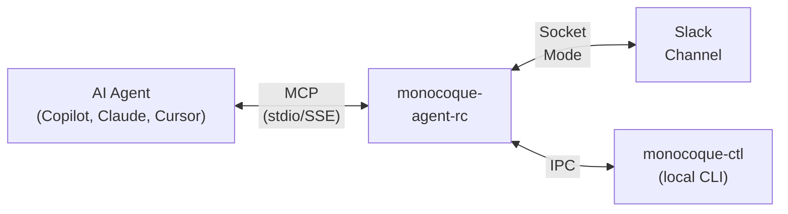

# monocoque-agent-rc

Agent Remote Control (ARC) — an MCP server that gives you remote visibility and control over autonomous AI coding agents through Slack.

## What It Does

When an AI agent (GitHub Copilot, Claude, Cursor) wants to modify your code, monocoque-agent-rc intercepts the change, posts an approval request to your Slack channel with the proposed diff, and **blocks the agent** until you click Accept or Reject. You can monitor and control multiple agent sessions from your phone, tablet, or any device with Slack.



## Key Features

- **Approval gate** — review diffs and accept/reject code changes from Slack
- **Continuation prompts** — agents ask before proceeding; you Continue, Refine, or Stop
- **Stall detection** — automatic alerts when agents go idle, with auto-nudge
- **Session management** — start, pause, resume, and terminate agent sessions via Slack commands
- **Checkpoints** — snapshot workspace state and detect divergences
- **Auto-approve policies** — configure low-risk operations to bypass approval (hot-reloaded)
- **Per-workspace channels** — route each VS Code workspace to a different Slack channel
- **Three operational modes** — Remote (Slack), Local (CLI), or Hybrid (both)
- **Atomic file writes** — crash-safe diff application with SHA-256 integrity checks
- **Local CLI companion** — `monocoque-ctl` for fast approvals when at your desk

## Installation

### Option A — Download pre-built binary (recommended)

Download the archive for your platform from the [latest release](https://github.com/softwaresalt/monocoque-agent-rc/releases/latest):

| Platform | Archive |
|---|---|
| Windows x64 | `monocoque-agent-rc-vX.Y.Z-x86_64-pc-windows-msvc.zip` |
| Linux x64 | `monocoque-agent-rc-vX.Y.Z-x86_64-unknown-linux-gnu.tar.gz` |
| macOS Apple Silicon | `monocoque-agent-rc-vX.Y.Z-aarch64-apple-darwin.tar.gz` |
| macOS Intel | `monocoque-agent-rc-vX.Y.Z-x86_64-apple-darwin.tar.gz` |

Each archive contains `monocoque-agent-rc` (or `.exe`), `monocoque-ctl`, and `config.toml.example`. Extract everything to a single folder.

### Option B — Build from source (requires Rust)

```bash
cargo install --git https://github.com/softwaresalt/monocoque-agent-rc --locked
```

Or clone and build locally:

```bash
git clone https://github.com/softwaresalt/monocoque-agent-rc.git
cd monocoque-agent-rc
cargo build --release
# Binaries land in target/release/
```

## Quick Start

### 1. Create a Slack App

Create a Slack app with Socket Mode enabled and these bot token scopes: `chat:write`, `channels:history`, `channels:read`, `files:write`, `commands`. See the [Setup Guide](docs/setup-guide.md#2-create-a-slack-app) for detailed steps.

### 2. Set Credentials

```bash
export SLACK_APP_TOKEN="xapp-1-..."
export SLACK_BOT_TOKEN="xoxb-..."
export SLACK_TEAM_ID="T01234ABCDE"
export SLACK_MEMBER_IDS="U0123456789"
```

### 3. Configure

Edit `config.toml`:

```toml
default_workspace_root = "/path/to/your/project"
http_port = 3000
host_cli = "/path/to/copilot"
host_cli_args = ["--stdio"]

[database]
path = "data/monocoque.db"

[slack]
channel_id = "{your-slack-channel-id}"
```

### 4. Run

```bash
# In the folder where you extracted the release archive:
RUST_LOG=info ./monocoque-agent-rc
# Windows:
.\monocoque-agent-rc.exe
```

Pass `--config <path>` to use a config file in a different location. The default is `config.toml` in the current directory.

### 5. Connect Your IDE

Add to `.vscode/mcp.json`:

```jsonc
{
  "servers": {
    "monocoque-agent-rc": {
      "type": "sse",
      "url": "http://127.0.0.1:3000/sse?channel_id={your-slack-channel-id}"
    }
  }
}
```

## Documentation

| Document | Description |
|---|---|
| [Setup Guide](docs/setup-guide.md) | Installation, Slack app creation, configuration, and first run |
| [User Guide](docs/user-guide.md) | All features, MCP tools, Slack commands, CLI usage, and policies |
| [Reference](docs/REFERENCE.md) | Complete technical reference with schemas, parameters, and internals |

## MCP Tools (9)

| Tool | Blocking | Description |
|---|---|---|
| `ask_approval` | Yes | Submit a code proposal for operator approval via Slack |
| `accept_diff` | No | Apply an approved diff to the filesystem |
| `check_auto_approve` | No | Query the workspace auto-approve policy |
| `forward_prompt` | Yes | Forward a continuation prompt to the operator |
| `wait_for_instruction` | Yes | Place the agent in standby until the operator responds |
| `heartbeat` | No | Liveness signal; resets stall detection timer |
| `remote_log` | No | Post a status message to Slack |
| `recover_state` | No | Check for interrupted sessions from a prior crash |
| `set_operational_mode` | No | Switch between remote, local, and hybrid modes |

## Slack Commands

```
/monocoque help                          Show available commands
/monocoque sessions                      List active sessions
/monocoque session-start <prompt>        Start a new agent session
/monocoque session-pause [id]            Pause a session
/monocoque session-resume [id]           Resume a paused session
/monocoque session-clear [id]            Terminate a session
/monocoque session-checkpoint [id] [l]   Create a workspace checkpoint
/monocoque session-checkpoints [id]      List checkpoints
/monocoque session-restore <ckpt_id>     Restore a checkpoint
/monocoque list-files [path] [--depth N] Browse workspace files
/monocoque show-file <path> [--lines]    View file contents
```

## Local CLI

```bash
monocoque-ctl list                           # List sessions
monocoque-ctl approve <request_id>           # Approve a pending request
monocoque-ctl reject <id> --reason "..."     # Reject with reason
monocoque-ctl resume ["instruction"]         # Resume a waiting agent
monocoque-ctl mode remote|local|hybrid       # Switch mode
```

## Technology

| Component | Technology |
|---|---|
| Language | Rust (stable, edition 2021) |
| MCP SDK | rmcp 0.5 |
| HTTP | axum 0.8 |
| Slack | slack-morphism 2.17 (Socket Mode) |
| Database | SQLite via sqlx 0.8 |
| IPC | interprocess 2.0 (named pipes / Unix sockets) |

## License

See [LICENSE](LICENSE).

