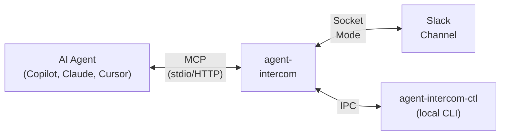

# agent-intercom

Agent Intercom — an MCP server that gives you remote visibility and control over autonomous AI coding agents through Slack.

## What It Does

When an AI agent (GitHub Copilot, Claude, Cursor) wants to modify your code, agent-intercom intercepts the change, posts an approval request to your Slack channel with the proposed diff, and **blocks the agent** until you click Accept or Reject. You can monitor and control multiple agent sessions from your phone, tablet, or any device with Slack.



## Key Features

- **Approval gate** — review diffs and accept/reject code changes from Slack
- **Continuation prompts** — agents ask before proceeding; you Continue, Refine, or Stop
- **Stall detection** — automatic alerts when agents go idle, with auto-nudge
- **Session management** — start, pause, resume, and terminate agent sessions via Slack commands
- **Checkpoints** — snapshot workspace state and detect divergences
- **Auto-approve policies** — configure low-risk operations to bypass approval (hot-reloaded)
- **Per-workspace channels** — route each VS Code workspace to a different Slack channel
- **Three operational modes** — Remote (Slack), Local (CLI), or Hybrid (both)
- **Atomic file writes** — crash-safe diff application with SHA-256 integrity checks
- **Local CLI companion** — `agent-intercom-ctl` for fast approvals when at your desk

## Installation

### Option A — Download pre-built binary (recommended)

Download the archive for your platform from the [latest release](https://github.com/softwaresalt/agent-intercom/releases/latest):

| Platform | Archive |
|---|---|
| Windows x64 | `agent-intercom-vX.Y.Z-x86_64-pc-windows-msvc.zip` |
| Linux x64 | `agent-intercom-vX.Y.Z-x86_64-unknown-linux-gnu.tar.gz` |
| macOS Apple Silicon | `agent-intercom-vX.Y.Z-aarch64-apple-darwin.tar.gz` |
| macOS Intel | `agent-intercom-vX.Y.Z-x86_64-apple-darwin.tar.gz` |

Each archive contains `agent-intercom` (or `.exe`), `agent-intercom-ctl`, and `config.toml.example`. Extract everything to a single folder.

### Option B — Build from source (requires Rust)

```bash
cargo install --git https://github.com/softwaresalt/agent-intercom --locked
```

Or clone and build locally:

```bash
git clone https://github.com/softwaresalt/agent-intercom.git
cd agent-intercom
cargo build --release
# Binaries land in target/release/
```

## Quick Start

### 1. Create a Slack App

Create a Slack app with Socket Mode enabled and these bot token scopes: `chat:write`, `channels:history`, `channels:read`, `files:write`, `commands`. See the [Setup Guide](docs/setup-guide.md#2-create-a-slack-app) for detailed steps.

### 2. Set Credentials

```bash
export SLACK_APP_TOKEN="xapp-1-..."
export SLACK_BOT_TOKEN="xoxb-..."
export SLACK_TEAM_ID="T01234ABCDE"
export SLACK_MEMBER_IDS="U0123456789"
```

### 3. Configure

Edit `config.toml`:

```toml
default_workspace_root = "/path/to/your/project"
http_port = 3000
host_cli = "copilot"
host_cli_args = ["--sse"]

[database]
path = "data/agent-intercom.db"

[slack]
# Credentials from env vars or OS keychain — see docs/configuration.md
```

### 4. Run

```bash
# In the folder where you extracted the release archive:
RUST_LOG=info ./agent-intercom
# Windows:
.\agent-intercom.exe
```

Pass `--config <path>` to use a config file in a different location. The default is `config.toml` in the current directory.

### 5. Connect Your IDE

Add to `.vscode/mcp.json`. Use `workspace_id` (recommended — maps to a channel in `config.toml`) or `channel_id` (direct, for single-workspace setups):

```jsonc
{
  "servers": {
    "agent-intercom": {
      "type": "http",
      "url": "http://127.0.0.1:3000/mcp?workspace_id=my-repo"
    }
  }
}
```

See [Configuration Reference](docs/configuration.md#workspace) for `[[workspace]]` mapping setup.

## Documentation

| Document | Description |
|---|---|
| [Setup Guide](docs/setup-guide.md) | Installation, Slack app creation, configuration, and first run |
| [User Guide](docs/user-guide.md) | All features, MCP tools, Slack commands, CLI usage, and policies |
| [Configuration Reference](docs/configuration.md) | Comprehensive `config.toml` breakdown with all settings and defaults |
| [CLI Reference](docs/cli-reference.md) | Complete `agent-intercom-ctl` subcommand reference |
| [Developer Guide](docs/developer-guide.md) | Build instructions, testing, project structure, and contribution workflow |
| [Migration Guide](docs/migration-guide.md) | Transition steps from an earlier installation |
| [Reference](docs/REFERENCE.md) | Complete technical reference with schemas, parameters, and internals |

## MCP Tools (9)

| Tool | Blocking | Description |
|---|---|---|
| `check_clearance` | Yes | Submit a code proposal for operator approval via Slack |
| `check_diff` | No | Apply an approved diff to the filesystem |
| `auto_check` | Varies | Query auto-approve policy; blocks for terminal commands needing approval |
| `transmit` | Yes | Forward a continuation prompt to the operator |
| `standby` | Yes | Place the agent in standby until the operator responds |
| `ping` | No | Liveness signal; resets stall detection timer |
| `broadcast` | No | Post a status message to Slack |
| `reboot` | No | Check for interrupted sessions from a prior crash |
| `switch_freq` | No | Switch between remote, local, and hybrid modes |

## Slack Commands

```
/intercom help                          Show available commands
/intercom sessions                      List active sessions
/intercom session-start <prompt>        Start a new agent session
/intercom session-pause [id]            Pause a session
/intercom session-resume [id]           Resume a paused session
/intercom session-clear [id]            Terminate a session
/intercom session-checkpoint [id] [l]   Create a workspace checkpoint
/intercom session-checkpoints [id]      List checkpoints
/intercom session-restore <ckpt_id>     Restore a checkpoint
/intercom list-files [path] [--depth N] Browse workspace files
/intercom show-file <path> [--lines]    View file contents
/intercom steer <message>               Send steering message to agent
/intercom task <message>                Queue a task for agent cold-start
```

## Local CLI

```bash
agent-intercom-ctl list                           # List sessions
agent-intercom-ctl approve <request_id>           # Approve a pending request
agent-intercom-ctl reject <id> --reason "..."     # Reject with reason
agent-intercom-ctl resume ["instruction"]         # Resume a waiting agent
agent-intercom-ctl mode remote|local|hybrid       # Switch mode
```

## ACP Mode

ACP (Agent Communication Protocol) mode is an alternative server mode where agent-intercom **spawns the AI agent CLI as a subprocess** and communicates with it via a newline-delimited JSON (NDJSON) stream on stdin/stdout, rather than acting as an MCP server that the agent connects to.

Use ACP mode when:

- The agent CLI supports an NDJSON stream interface (e.g., a custom agent built against the ACP protocol).
- You want the server to own the agent process lifecycle (spawn, monitor, restart).
- You are running without an IDE MCP integration.

### Enabling ACP Mode

```bash
agent-intercom --mode acp
```

### Configuration

```toml
# host_cli is required for ACP mode — set it to the agent command.
host_cli = "my-agent"
host_cli_args = ["--stream"]

[acp]
max_sessions = 5              # concurrent ACP sessions (default: 5)
startup_timeout_seconds = 30  # seconds to wait for agent ready signal (default: 30)
```

ACP mode uses separate credential sources: `SLACK_BOT_TOKEN_ACP`, `SLACK_APP_TOKEN_ACP`, `SLACK_MEMBER_IDS_ACP` (falls back to shared vars if not set). This lets one machine run an MCP server and an ACP server with different Slack identities.

See [Configuration Reference](docs/configuration.md#acp) for full details.

## Technology

| Component | Technology |
|---|---|
| Language | Rust (stable, edition 2021) |
| MCP SDK | rmcp 0.13 |
| HTTP | axum 0.8 |
| Slack | slack-morphism 2.17 (Socket Mode) |
| Database | SQLite via sqlx 0.8 |
| IPC | interprocess 2.0 (named pipes / Unix sockets) |

## License

See [LICENSE](LICENSE).
