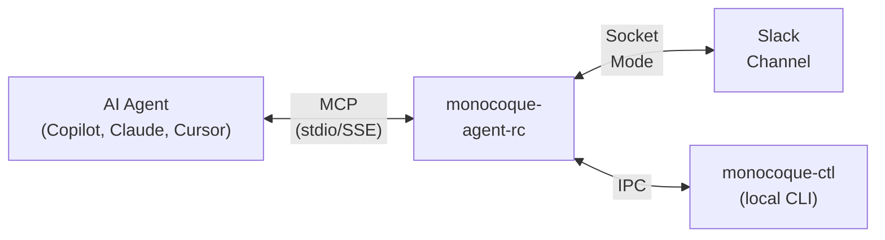

# User Guide

A complete guide to operating monocoque-agent-rc — the Agent Remote Control MCP server for agentic development IDEs.

## How It Works

monocoque-agent-rc sits between your AI coding agent (GitHub Copilot, Claude, Cursor) and your Slack workspace. When the agent wants to make code changes, the server:

1. **Posts an approval request** to your Slack channel with the proposed diff.
2. **Blocks the agent** until you click Accept or Reject.
3. **Applies the approved changes** atomically to your filesystem.

This gives you remote visibility and control over what autonomous agents do in your codebase — from your phone, tablet, or any device with Slack.



## Operational Modes

The server supports three routing modes, switchable at runtime:

| Mode | Slack | IPC (monocoque-ctl) | Use Case |
|---|---|---|---|
| **Remote** | Active | Inactive | Monitor and control from anywhere via Slack |
| **Local** | Inactive | Active | Fast local approvals via CLI when at your desk |
| **Hybrid** | Active | Active | Both channels active; first response wins |

Switch modes via Slack:

```
/monocoque mode remote
/monocoque mode local
/monocoque mode hybrid
```

Or via the local CLI:

```bash
monocoque-ctl mode hybrid
```

## MCP Tools

These are the tools the server exposes to AI agents via the Model Context Protocol. Agents call these tools automatically during their workflow.

### ask_approval

Submits a code change proposal for your approval. **Blocks the agent** until you respond.

When called, you see a Slack message with:
- Title and description of the proposed change
- The target file path and risk level badge (🟢 low, 🟡 high, 🔴 critical)
- A diff preview (or file snippet for large diffs)
- **Accept** and **Reject** buttons

Click **Accept** to let the agent proceed, or **Reject** to deny the change.

### accept_diff

Applies a previously approved diff to the filesystem. Called by the agent after you approve a change.

- Verifies the file hasn't changed since the proposal (SHA-256 integrity check).
- Applies unified diffs via patch, or writes full file content.
- Uses atomic writes (temp file + rename) to prevent corruption.
- Can force-apply with `force: true` if the file has diverged.

### check_auto_approve

Queries the workspace auto-approve policy to check if an operation can skip the approval gate. Non-blocking. Returns whether the operation is auto-approved and which rule matched.

### forward_prompt

Forwards a continuation prompt to you via Slack. **Blocks the agent** until you respond.

You see a message with the prompt text and three buttons:
- **Continue** — let the agent proceed with its plan
- **Refine** — provide revised instructions
- **Stop** — halt the agent

Prompt types: continuation (🔄), clarification (❓), error recovery (⚠️), resource warning (📊).

If you don't respond within 30 minutes (configurable), the agent auto-continues.

### wait_for_instruction

Places the agent in standby mode. **Blocks** until you respond.

You see a waiting message with:
- **Resume** — wake the agent with no specific instructions
- **Resume with Instructions** — provide new directions
- **Stop Session** — terminate the agent session

### heartbeat

A lightweight liveness signal. Resets the stall detection timer and optionally stores a structured progress snapshot. Non-blocking.

### remote_log

Sends a status log message to Slack with severity-based formatting (ℹ️ info, ✅ success, ⚠️ warning, ❌ error). Non-blocking.

### recover_state

Called by agents on startup to check for interrupted sessions from a prior server crash. Returns pending approval requests, prompts, and the last checkpoint.

### set_operational_mode

Switches between remote, local, and hybrid modes at runtime.

## MCP Resources

### slack://channel/{id}/recent

Agents can read recent messages from your Slack channel. This lets the agent see instructions you've posted directly in the channel.

**URI format:** `slack://channel/C0AG6S5D87N/recent?limit=20`

Returns up to 100 recent messages (default 20) in JSON format.

## Slack Commands

All commands use the `/monocoque` slash command prefix. Only authorized users (listed in `SLACK_MEMBER_IDS`) can execute commands.

### Session Management

| Command | Description |
|---|---|
| `/monocoque sessions` | List all active sessions with status, workspace, and last activity |
| `/monocoque session-start <prompt>` | Start a new agent session with the given task prompt |
| `/monocoque session-pause [session_id]` | Pause a running session (defaults to your most recent) |
| `/monocoque session-resume [session_id]` | Resume a paused session |
| `/monocoque session-clear [session_id]` | Terminate and clean up a session (5s grace period, then force-kill) |

### Checkpoints

Checkpoints snapshot the workspace state so you can detect what changed.

| Command | Description |
|---|---|
| `/monocoque session-checkpoint [session_id] [label]` | Create a named checkpoint (hashes all workspace files) |
| `/monocoque session-checkpoints [session_id]` | List all checkpoints for a session |
| `/monocoque session-restore <checkpoint_id>` | Restore a checkpoint; shows files that have diverged |

Divergence types reported on restore:
- **Modified** — file content changed since checkpoint
- **Deleted** — file existed at checkpoint time but is now missing
- **Added** — file was created after the checkpoint

### File Browsing

| Command | Description |
|---|---|
| `/monocoque list-files [path] [--depth N]` | List the workspace directory tree (default depth: 3) |
| `/monocoque show-file <path> [--lines START:END]` | Display file contents with syntax highlighting |

### Custom Commands

Any command alias defined in `config.toml [commands]` can be invoked directly:

```
/monocoque status
```

This executes the mapped shell command (`git status`) in the workspace root and posts the output to Slack.

### Help

```
/monocoque help [category]
```

Categories: `session`, `checkpoint`, `files`, or omit for all.

## Local CLI (monocoque-ctl)

The companion CLI communicates with the server via IPC (named pipes on Windows, Unix sockets on Linux/macOS).

### Commands

```bash
# List active sessions
monocoque-ctl list

# Approve a pending request
monocoque-ctl approve <request_id>

# Reject a pending request
monocoque-ctl reject <request_id> --reason "needs error handling"

# Resume a waiting agent
monocoque-ctl resume
monocoque-ctl resume "focus on the API tests next"

# Switch operational mode
monocoque-ctl mode local
monocoque-ctl mode remote
monocoque-ctl mode hybrid
```

### Options

| Flag | Default | Description |
|---|---|---|
| `--ipc-name` | `monocoque-agent-rc` | IPC socket name (must match the server) |

## Stall Detection

The server monitors agent activity and alerts you when an agent goes idle.

**How it works:**

1. Every MCP tool call and heartbeat resets an inactivity timer.
2. If no activity occurs for `inactivity_threshold_seconds` (default: 5 minutes), a stall alert is posted to Slack.
3. The server auto-nudges the agent up to `max_retries` times (default: 3) at `escalation_threshold_seconds` intervals (default: 2 minutes).
4. If auto-nudges don't resolve the stall, the alert escalates.

**Slack stall alert buttons:**

| Button | Effect |
|---|---|
| **Nudge** | Send the default nudge message to the agent, reset timer |
| **Nudge with Instructions** | Send a custom message to the agent |
| **Stop Session** | Terminate the stalled session |

## Auto-Approve Policy

Create `.monocoque/settings.json` in your workspace root to let low-risk operations bypass the approval gate.

```json
{
  "enabled": true,
  "tools": ["heartbeat", "remote_log", "check_auto_approve"],
  "file_patterns": {
    "write": ["**/*.md", "docs/**", "tests/**"],
    "read": ["**/*"]
  },
  "risk_level_threshold": "low"
}
```

**Evaluation order:**

1. Is the policy enabled? If not, deny.
2. Does the risk level exceed the threshold? If yes, deny. (`critical` is never auto-approved.)
3. Does the tool/command match the `commands` list (and the global allowlist)? If yes, approve.
4. Does the tool name match the `tools` list? If yes, approve.
5. Does the file path match a `file_patterns` glob? If yes, approve.
6. No match — deny (requires manual approval).

The policy file is **hot-reloaded** — changes take effect immediately without restarting the server.

## Per-Workspace Channel Routing

Each VS Code workspace can send notifications to a different Slack channel. Set the `channel_id` query parameter in `.vscode/mcp.json`:

```jsonc
// Workspace A → #frontend-agent channel
{
  "servers": {
    "monocoque-agent-rc": {
      "type": "sse",
      "url": "http://127.0.0.1:3000/sse?channel_id=C0123FRONTEND"
    }
  }
}
```

```jsonc
// Workspace B → #backend-agent channel
{
  "servers": {
    "monocoque-agent-rc": {
      "type": "sse",
      "url": "http://127.0.0.1:3000/sse?channel_id=C0456BACKEND"
    }
  }
}
```

When omitted, the global `slack.channel_id` from `config.toml` is used.

## Server Lifecycle

### Startup Sequence

1. Loads configuration and credentials.
2. Connects to SQLite (creates DB and schema if needed).
3. Starts the data retention service.
4. Starts the Slack Socket Mode client.
5. Checks for interrupted sessions from a prior crash and posts a recovery summary.
6. Starts the stdio transport (primary agent connection).
7. Starts the HTTP/SSE transport on `127.0.0.1:{http_port}`.

### Graceful Shutdown

On Ctrl+C or SIGTERM:

1. Cancels all background tasks.
2. Marks all pending approvals and prompts as interrupted.
3. Marks all active sessions as interrupted.
4. Posts a shutdown notification to Slack.
5. Waits for in-flight operations to complete.

### Crash Recovery

On next startup after a crash, the server detects interrupted sessions and posts a summary to Slack. Agents can call `recover_state` to resume where they left off.

## Data Retention

Terminated session data is automatically purged after `retention_days` (default: 30 days). The retention service runs hourly and deletes in dependency order: stall alerts → checkpoints → prompts → approvals → sessions.

## Security

### Path Safety

All file operations are validated against the workspace root:
- Paths are canonicalized and checked with `starts_with(workspace_root)`.
- Symlink escapes are detected by resolving symlinks and re-checking containment.
- Path traversal attempts (`../`) are rejected.
- Absolute paths outside the workspace root are rejected.

### Authorization

- All Slack commands and interactive actions check the caller against the `SLACK_MEMBER_IDS` list.
- Unauthorized users are silently ignored.
- Session operations validate ownership.
- IPC commands use a per-instance shared secret token.

### Double-Submission Prevention

When you click an approval button, the server immediately replaces the buttons with "Processing..." text via `chat.update` before executing the action. This prevents accidental double-clicks.

### Atomic File Writes

All file modifications use a temp-file-and-rename pattern via the `tempfile` crate. This prevents partial writes if the server crashes mid-write.
