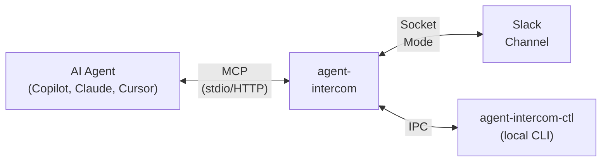

# User Guide

A complete guide to operating agent-intercom — the Agent Intercom MCP server for agentic development IDEs.

## How It Works

agent-intercom sits between your AI coding agent (GitHub Copilot, Claude, Cursor) and your Slack workspace. When the agent wants to make code changes, the server:

1. **Posts an approval request** to your Slack channel with the proposed diff.
2. **Blocks the agent** until you click Accept or Reject.
3. **Applies the approved changes** atomically to your filesystem.

This gives you remote visibility and control over what autonomous agents do in your codebase — from your phone, tablet, or any device with Slack.



## Operational Modes

The server supports three routing modes, switchable at runtime:

| Mode | Slack | IPC (agent-intercom-ctl) | Use Case |
|---|---|---|---|
| **Remote** | Active | Inactive | Monitor and control from anywhere via Slack |
| **Local** | Inactive | Active | Fast local approvals via CLI when at your desk |
| **Hybrid** | Active | Active | Both channels active; first response wins |

Switch modes via Slack:

```
/intercom mode remote
/intercom mode local
/intercom mode hybrid
```

Or via the local CLI:

```bash
agent-intercom-ctl mode hybrid
```

## MCP Tools

These are the tools the server exposes to AI agents via the Model Context Protocol. Agents call these tools automatically during their workflow.

### check_clearance

Submits a code change proposal for your approval. **Blocks the agent** until you respond.

When called, you see a Slack message with:
- Title and description of the proposed change
- The target file path and risk level badge (🟢 low, 🟡 high, 🔴 critical)
- A diff preview (or file snippet for large diffs)
- **Accept** and **Reject** buttons

Click **Accept** to let the agent proceed, or **Reject** to deny the change.

### check_diff

Applies a previously approved diff to the filesystem. Called by the agent after you approve a change.

- Verifies the file hasn't changed since the proposal (SHA-256 integrity check).
- Applies unified diffs via patch, or writes full file content.
- Uses atomic writes (temp file + rename) to prevent corruption.
- Can force-apply with `force: true` if the file has diverged.

### auto_check

Queries the workspace auto-approve policy to check if an operation can skip the approval gate. Returns whether the operation is auto-approved and which rule matched.

When called with `kind: "terminal_command"` for a command that is not auto-approved, the tool **blocks** and posts an approval prompt to Slack. The operator can approve or reject the command. On approval, the server offers to add an auto-approve pattern for similar commands.

### transmit

Forwards a continuation prompt to you via Slack. **Blocks the agent** until you respond.

You see a message with the prompt text and three buttons:
- **Continue** — let the agent proceed with its plan
- **Refine** — provide revised instructions
- **Stop** — halt the agent

Prompt types: continuation (🔄), clarification (❓), error recovery (⚠️), resource warning (📊).

If you don't respond within 30 minutes (configurable), the agent auto-continues.

### standby

Places the agent in standby mode. **Blocks** until you respond.

You see a waiting message with:
- **Resume** — wake the agent with no specific instructions
- **Resume with Instructions** — provide new directions
- **Stop Session** — terminate the agent session

### ping

A lightweight liveness signal. Resets the stall detection timer and optionally stores a structured progress snapshot. Non-blocking.

### broadcast

Sends a status log message to Slack with severity-based formatting (ℹ️ info, ✅ success, ⚠️ warning, ❌ error). Non-blocking.

### reboot

Called by agents on startup to check for interrupted sessions from a prior server crash. Returns pending approval requests, prompts, and the last checkpoint.

### switch_freq

Switches between remote, local, and hybrid modes at runtime.

## MCP Resources

### slack://channel/{id}/recent

Agents can read recent messages from your Slack channel. This lets the agent see instructions you've posted directly in the channel.

**URI format:** `slack://channel/C0AG6S5D87N/recent?limit=20`

Returns up to 100 recent messages (default 20) in JSON format.

## Session Concepts

Before using session commands, it helps to understand how sessions work.

### Sessions are live connections, not durable workspaces

A session is a metadata record tied to a live MCP connection between an agent and the server. It tracks the agent's current state — last tool called, pending approvals, progress snapshot, operational mode. When the agent disconnects (you close VS Code, the agent finishes, or the transport drops), the session is terminated. It becomes a historical record.

Sessions cannot be "re-entered" or "re-attached" after the connection closes. A new agent connection always creates a new session.

### Session ownership

There are two kinds of sessions:

| Type | Owner | Created by |
|---|---|---|
| Primary agent session | `agent:local` | Automatically when your IDE's agent connects via MCP |
| Spawned session | Your Slack user ID | `/intercom session-start <prompt>` |

This distinction matters because `session-pause`, `session-resume`, and `session-clear` check ownership. Your Slack user can only manage sessions you own — which means spawned sessions. The primary agent's session (owned by `agent:local`) cannot be paused or cleared from Slack.

### Session lifecycle

```
Created → Active → Paused → Active → ...
                  ↘ Terminated
                  ↘ Interrupted (server shutdown)
```

| Status | Meaning |
|---|---|
| `Created` | Session record exists, agent not yet connected |
| `Active` | Agent is connected and processing tool calls |
| `Paused` | Agent remains connected but tool calls are blocked |
| `Terminated` | Session ended normally (agent disconnected or operator cleared) |
| `Interrupted` | Server shut down while the session was active |

When the server starts, it checks for interrupted sessions and posts a recovery summary to Slack. When a new primary agent connects, all previous `agent:local` sessions in Active status are automatically terminated (stale cleanup).

### What session-pause and session-resume actually do

These commands flip a status flag in the database. They do not disconnect or reconnect the agent process. `session-pause` sets status to `Paused`, which causes subsequent tool calls from the agent to be rejected. `session-resume` sets it back to `Active`.

Neither command affects the MCP transport connection itself. The agent remains connected but idle while paused.

### Why you cannot resume a session from a previous day

If you close your IDE and reopen it the next day, the old session cannot be resumed. Three things prevent this:

1. **Transport disconnect terminates the session.** When the IDE closes, the MCP connection drops. The server's `Drop` handler sets the session to `Terminated`.
2. **Stale cleanup on reconnect.** When the next agent connects, `on_initialized` terminates any remaining `agent:local` sessions that were still marked Active.
3. **No re-attachment path.** `session-resume` sets a DB flag — it does not re-establish a transport connection. Even if you flipped the flag, the old session has no agent process listening on the other end.

To carry context forward across days, use checkpoints (see below).

## Slack Commands

All commands use the `/intercom` slash command prefix. Only authorized users (listed in `SLACK_MEMBER_IDS`) can execute commands.

### Session Management

| Command | Description |
|---|---|
| `/intercom sessions` | List all active sessions with status, workspace, and last activity |
| `/intercom session-start <prompt>` | Start a new agent session with the given task prompt |
| `/intercom session-pause [session_id]` | Pause a running session (defaults to your most recent active session) |
| `/intercom session-resume [session_id]` | Resume a paused session (reactivates tool call processing) |
| `/intercom session-clear [session_id]` | Terminate a session: 5s grace period, then force-kill child process |

When `[session_id]` is omitted, the command targets your most recently active session. For spawned sessions, this is determined by matching your Slack user ID against the session's owner. You cannot pause, resume, or clear sessions owned by other operators.

### Checkpoints

Checkpoints snapshot the session state and workspace file hashes so you can detect what changed and carry context across agent sessions.

| Command | Description |
|---|---|
| `/intercom session-checkpoint [session_id] [label]` | Create a named checkpoint (hashes all workspace files) |
| `/intercom session-checkpoints [session_id]` | List all checkpoints for a session |
| `/intercom session-restore <checkpoint_id>` | Show files that diverged since the checkpoint (operator diagnostic) |

Divergence types reported on restore:
- **Modified** — file content changed since checkpoint
- **Deleted** — file existed at checkpoint time but is now missing
- **Added** — file was created after the checkpoint

**Important:** `session-restore` is an operator diagnostic tool — it reports file divergences to you in Slack. It does not deliver context to the running agent. To give the agent the checkpoint context, the agent must call the `reboot` MCP tool with the old session's ID (see "Carrying context across sessions" below).

### Carrying Context Across Sessions

When you end a day's work and reopen your IDE the next day, a new session is created automatically. The old session is terminated. To hand off context from the previous session to the new one:

**End of day (before closing your IDE):**

1. Create a checkpoint: `/intercom session-checkpoint "end of day - working on auth module"`
2. Note the checkpoint ID and session ID from the response.

**Next day (after the new agent session connects):**

1. Optionally check divergence: `/intercom session-restore <old-checkpoint-id>` — this shows you (in Slack) what changed overnight, but does not affect the agent.
2. The agent calls `reboot` (also called `recover_state`) with the old session's ID:
   ```json
   { "session_id": "<yesterday's session id>" }
   ```
   This returns the old session's progress snapshot, last checkpoint, pending items, and inbox tasks to the agent directly.

**Alternatively**, list your old session's checkpoints to find the right one:
```
/intercom session-checkpoints <old-session-id>
```

The key distinction: Slack commands report to you in Slack. The agent receives context only through MCP tool calls (`reboot`/`recover_state`). There is currently no Slack command that pushes recovery context directly into the running agent.

### File Browsing

| Command | Description |
|---|---|
| `/intercom list-files [path] [--depth N]` | List the workspace directory tree (default depth: 3) |
| `/intercom show-file <path> [--lines START:END]` | Display file contents with syntax highlighting |

### Steering and Tasks

| Command | Description |
|---|---|
| `/intercom steer <message>` | Send a steering message to the active agent (delivered on the next `ping`) |
| `/intercom task <message>` | Queue a task for delivery at agent cold-start via `reboot` |

### Custom Commands

Any command alias defined in `config.toml [commands]` can be invoked directly:

```
/intercom status
```

This executes the mapped shell command (`git status`) in the workspace root and posts the output to Slack.

### Help

```
/intercom help [category]
```

Categories: `session`, `checkpoint`, `files`, or omit for all.

## Local CLI (agent-intercom-ctl)

The companion CLI communicates with the server via IPC (named pipes on Windows, Unix sockets on Linux/macOS).

### Commands

```bash
# List active sessions
agent-intercom-ctl list

# Approve a pending request
agent-intercom-ctl approve <request_id>

# Reject a pending request
agent-intercom-ctl reject <request_id> --reason "needs error handling"

# Resume a waiting agent
agent-intercom-ctl resume
agent-intercom-ctl resume "focus on the API tests next"

# Switch operational mode
agent-intercom-ctl mode local
agent-intercom-ctl mode remote
agent-intercom-ctl mode hybrid
```

### Options

| Flag | Default | Description |
|---|---|---|
| `--ipc-name` | `agent-intercom` | IPC socket name (must match the server) |

## Stall Detection

The server monitors agent activity and alerts you when an agent goes idle.

**How it works:**

1. Every MCP tool call and heartbeat resets an inactivity timer.
2. If no activity occurs for `inactivity_threshold_seconds` (default: 5 minutes), a stall alert is posted to Slack.
3. The server auto-nudges the agent up to `max_retries` times (default: 3) at `escalation_threshold_seconds` intervals (default: 2 minutes).
4. If auto-nudges don't resolve the stall, the alert escalates.

**Slack stall alert buttons:**

| Button | Effect |
|---|---|
| **Nudge** | Send the default nudge message to the agent, reset timer |
| **Nudge with Instructions** | Send a custom message to the agent |
| **Stop Session** | Terminate the stalled session |

## Auto-Approve Policy

Create `.intercom/settings.json` in your workspace root to let low-risk operations bypass the approval gate.

```json
{
  "enabled": true,
  "tools": ["ping", "broadcast", "auto_check"],
  "file_patterns": {
    "write": ["**/*.md", "docs/**", "tests/**"],
    "read": ["**/*"]
  },
  "risk_level_threshold": "low"
}
```

**Evaluation order:**

1. Is the policy enabled? If not, deny.
2. Does the risk level exceed the threshold? If yes, deny. (`critical` is never auto-approved.)
3. Does the tool/command match the `commands` list (and the global allowlist)? If yes, approve.
4. Does the tool name match the `tools` list? If yes, approve.
5. Does the file path match a `file_patterns` glob? If yes, approve.
6. No match — deny (requires manual approval).

The policy file is **hot-reloaded** — changes take effect immediately without restarting the server.

## Per-Workspace Channel Routing

Each VS Code workspace can send notifications to a different Slack channel. Set the `channel_id` query parameter in `.vscode/mcp.json`:

```jsonc
// Workspace A → #frontend-agent channel
{
  "servers": {
    "agent-intercom": {
      "type": "http",
      "url": "http://127.0.0.1:3000/mcp?channel_id=C0123FRONTEND"
    }
  }
}
```

```jsonc
// Workspace B → #backend-agent channel
{
  "servers": {
    "agent-intercom": {
      "type": "http",
      "url": "http://127.0.0.1:3000/mcp?channel_id=C0456BACKEND"
    }
  }
}
```

When omitted, no Slack messages are posted for that workspace. There is no global channel fallback.

## Server Lifecycle

### Startup Sequence

1. Loads configuration and credentials.
2. Connects to SQLite (creates DB and schema if needed).
3. Starts the data retention service.
4. Starts the Slack Socket Mode client.
5. Checks for interrupted sessions from a prior crash and posts a recovery summary.
6. Starts the stdio transport (primary agent connection).
7. Starts the HTTP transport on `127.0.0.1:{http_port}`.

### Agent Connection and Disconnection

When an agent connects via MCP, the server auto-creates a session:

- **Primary agent** (VS Code, Copilot CLI): Session is owned by `agent:local`. Any previous `agent:local` sessions still marked Active are terminated first (stale cleanup).
- **Spawned agent** (`/intercom session-start`): Session is pre-created and owned by the Slack operator's user ID.

When the agent disconnects (IDE closed, process exited, transport dropped):

- The server's `Drop` handler marks the session as `Terminated` in the database.
- The session becomes a historical record. It cannot be re-entered.
- Checkpoints created during the session persist and can be referenced by future sessions via `reboot`.

### Graceful Shutdown

On Ctrl+C or SIGTERM:

1. Cancels all background tasks.
2. Marks all pending approvals and prompts as interrupted.
3. Marks all active sessions as interrupted.
4. Posts a shutdown notification to Slack.
5. Waits for in-flight operations to complete.

### Crash Recovery

On next startup after a crash, the server detects interrupted sessions and posts a summary to Slack. Agents can call `recover_state` to resume where they left off.

## Data Retention

Terminated session data is automatically purged after `retention_days` (default: 30 days). The retention service runs hourly and deletes in dependency order: stall alerts → checkpoints → prompts → approvals → sessions.

## Security

### Path Safety

All file operations are validated against the workspace root:
- Paths are canonicalized and checked with `starts_with(workspace_root)`.
- Symlink escapes are detected by resolving symlinks and re-checking containment.
- Path traversal attempts (`../`) are rejected.
- Absolute paths outside the workspace root are rejected.

### Authorization

- All Slack commands and interactive actions check the caller against the `SLACK_MEMBER_IDS` list.
- Unauthorized users are silently ignored.
- Session operations validate ownership.
- IPC commands use a per-instance shared secret token.

### Double-Submission Prevention

When you click an approval button, the server immediately replaces the buttons with "Processing..." text via `chat.update` before executing the action. This prevents accidental double-clicks.

### Atomic File Writes

All file modifications use a temp-file-and-rename pattern via the `tempfile` crate. This prevents partial writes if the server crashes mid-write.
